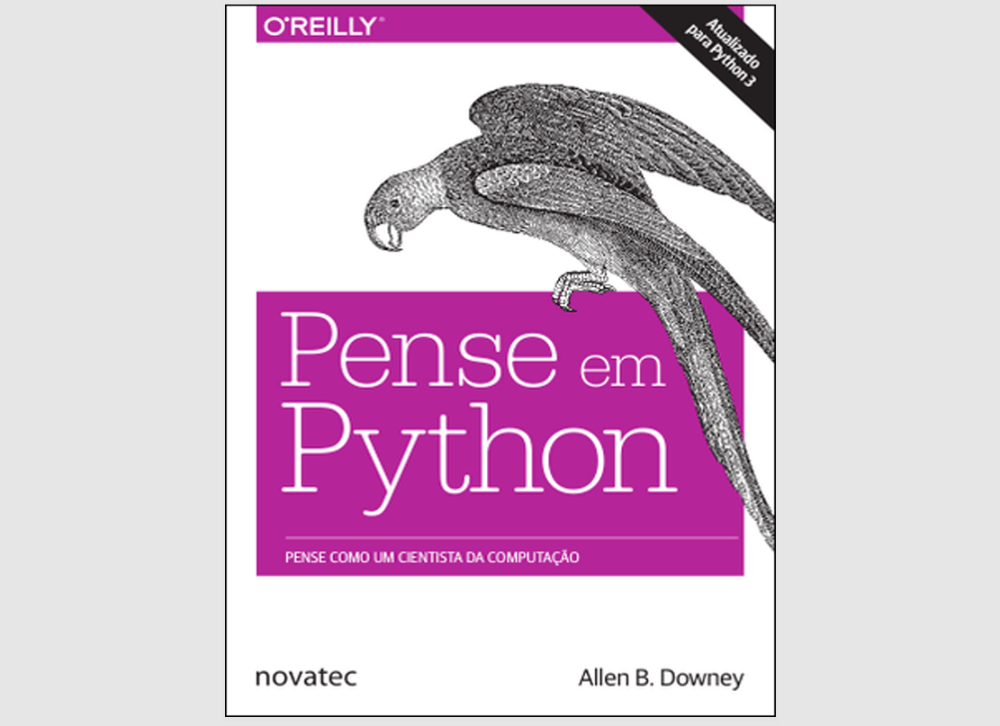

# Pense em Python 🐍

[](LICENSE)
[]()

Repositório de estudos baseado no livro **"Pense em Python"** (2ª ed.) de Allen B. Downey.  
Um projeto para dominar Python através da prática de conceitos fundamentais.

<p> 

</p>


> "Aprender Python não é apenas sobre sintaxe, é sobre aprender a pensar como um cientista da computação." - Allen B. Downey

## 📚 Biblioteca Pessoal Complementar
Acompanhe minhas anotações detalhadas e materiais extras no Notion:  
[](https://right-cheshire-510.notion.site/Python-46f1955a7e9e4b09ad101606425a904b?pvs=4)


## 📖 Abordagem de Estudo
Como Engenheiro de Dados com conhecimento prévio em Python, estou revisitando todos os capítulos com dois objetivos:

1. **Descobrir nuances conceituais** que podem ter passado despercebidas na prática profissional
2. **Documentar sistematicamente** toda a jornada de releitura:
   - ✅ Organiza exemplos por capítulo
   - 🔍 Registra insights avançados
   - ⚖️ Contrasta conhecimento prévio com o livro

### Por que começar do Capítulo 1?
✔ Validar fundamentos com olhar experiente  
✔ Identificar gaps em conceitos "básicos"  
✔ Coletar material didático para mentoria  

## 🚀 Objetivo
Transformar conhecimento teórico em prática através de:
- Exercícios resolvidos do livro
- Anotações comentadas
- Exemplos adicionais
- Desafios complementares

## 📂 Estrutura
├── capitulos/ # Códigos organizados por capítulos

├── exercicios/ # Soluções para os exercícios propostos

├── projetos/ # Aplicações práticas dos conceitos

├── anotacoes/ # Resumos e insights em Markdown

└── recursos/ # Materiais complementares


## 💻 Como Usar

1. Clone o repositório:
```bash
git clone https://github.com/Wesley-Alexsander/Pense-em-Python.git
```
2. Acesse um capítulo específico:
```bash
cd Pense-em-Python/capitulos/03-funcoes
```
3. Execute os exemplos:
```bash
python3 exemplo_funcoes.py
```


## 🤝 Contribuição
Encontrou um erro ou tem uma solução melhor? Sinta-se à vontade para:

- Abrir uma Issue

- Enviar um Pull Request

- Compartilhar ideias de melhorias


## 📌 Roadmap
Capítulo 1 - A Jornada do Programa

Capítulo 2 - Variáveis, Expressões e Instruções

Capítulo 3 - Funções

----------

📜 Licença
Este projeto está licenciado sob a MIT License - veja o arquivo LICENSE para detalhes.

