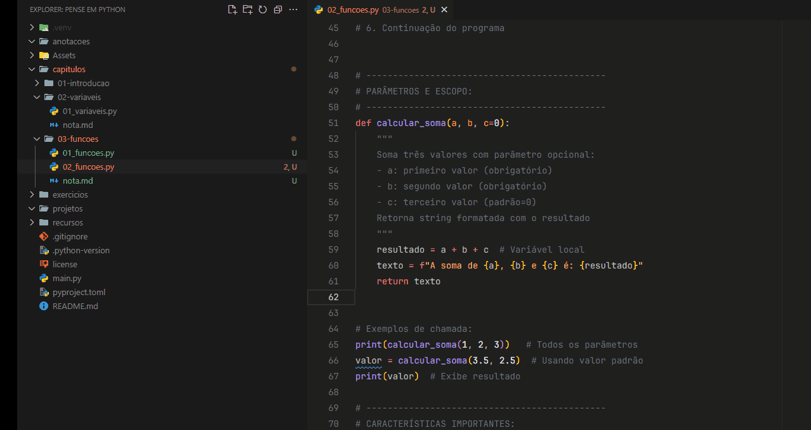

# 📘 Documentação Pessoal: Funções em Python  

<br>

## 📌 O que é uma Função?  
Uma função é um trecho de código nomeado que executa uma tarefa específica.  

Você pode pensar nela como um **"botão de atalho"** para uma tarefa comum. Quando você chama a função, ela:  
✔️ Executa o código interno  
✔️ Processa os dados recebidos (entrada)  
✔️ Retorna um resultado (se necessário)  

---  
<br>

## 🛠️ Exemplo do Mundo Real  
**Contexto:** Você trabalha em uma fábrica de camisetas.  

### Processo Manual (Sem Função):  
Sempre que um cliente faz um pedido, os vendedores precisam:  
1. Receber o **nome** e a **quantidade**  
2. Preencher um formulário manualmente  
3. Calcular o valor  
4. Gerar a etiqueta  

**Problema:**  
❌ Processo repetitivo  
❌ Alto risco de erros humanos  

### Solução com Função (Automatização):  
Crie um sistema (função) que:  
```python
def processar_pedido(nome, quantidade):
    # Passo 2: Preencher formulário automaticamente
    formulario = f"Pedido: {nome}, Quantidade: {quantidade}"
    
    # Passo 3: Calcular valor (ex.: R$ 20 por camiseta)
    valor = quantidade * 20
    
    # Passo 4: Gerar etiqueta
    etiqueta = f"Cliente: {nome}\nValor Total: R${valor}"
    
    return formulario, etiqueta
```
<br>

## 🧱 Estrutura de uma Função
### 🧩 Componentes Básicos:

```def``` → Palavra-chave que inicia a declaração<br>
```nome_da_funcao``` → Use snake_case (ex: calcular_imc)<br>
```parametros``` → Entradas da função (opcionais)<br>
```return``` → Retorna valor (opcional)<br>

```python
def nome_da_funcao(parametros):
    # bloco de código (indentado)
    return resultado
```
> Funções sem return retornam None automaticamente.

<br>

## 📂 Tipos de Funções
1. Funções Integradas (Built-in)
São funções que já fazem parte do Python e estão disponíveis para uso direto.

```python
print("Olá, Mundo!")        # Mostra mensagem no terminal
print(type(10))             # Mostra o tipo do número → <class 'int'>
```

2. Funções de Bibliotecas
Precisam ser importadas antes de usar. Exemplo: math, datetime, random.
```python
import math
print(math.sqrt(25))       # Raiz quadrada de 25 → 5.0
```
🧪 Aplicações Reais com Funções
Exemplo 1: Cálculo de SNR (Engenharia)
Imagine que você trabalha com equipamentos de áudio e precisa saber o quanto de ruído um microfone capta em relação ao sinal útil. A fórmula é:

```python
import math

P_sinal = 1000  # potência do sinal
P_ruido = 100   # potência do ruído

snr_db = 10 * math.log10(P_sinal / P_ruido)
print(f"SNR: {snr_db:.2f} dB")  # → 10.00 dB
```
Exemplo 2: Conversão de Graus para Radianos
Quando se trabalha com funções trigonométricas (como seno, cosseno, etc), o Python usa radianos e não graus.

```python
angulo = 45
radianos = math.radians(angulo)  # Converte para radianos
print(math.sin(radianos))        # Calcula o seno do ângulo
```
<br>

## 🔁 Composição de Funções
Você pode usar uma função dentro de outra, como se fosse um "encadeamento".

```python
x = 2
resultado = math.exp(math.log(x + 1))  # Retorna 3.0
```
<br>

## ✍️ Criando Suas Próprias Funções
Exemplo simples:
```python
def cumprimentar(nome):
    """Retorna uma saudação personalizada"""
    return f"Olá, {nome}! Como você está?"
```
Chamadas:
```python
print(cumprimentar("João"))
mensagem = cumprimentar("Maria")
print(mensagem)
```
<br>

## 🔄 Fluxo de Execução de uma Função
1. O Python encontra uma chamada de função.

2. Ele procura pela definição da função.

3. Os argumentos são passados para os parâmetros.

4. O bloco da função é executado linha por linha.

5. Se houver return, o valor é devolvido.

6. A execução do programa continua após a chamada.

#### 🔎 Você pode acompanhar esse fluxo usando o debugger do VS Code, como ilustrado no GIF:


> ### Note que a linha amarela é sempre o próximo step a ser executado, é para onde o cursor pula após executar uma instrução.
<br>

## ⚙️ Parâmetros e Escopo
```python

def calcular_soma(a, b, c=0):
    resultado = a + b + c
    return f"Soma: {a} + {b} + {c} = {resultado}"
```
Detalhes:
- a e b são obrigatórios.

- c é opcional, com valor padrão de 0.

- resultado é uma variável local, ou seja, só existe dentro da função.
<br>

## 🔎 Características Importantes
- Escopo: variáveis criadas dentro da função não existem fora dela.

- Parâmetros com valor padrão são opcionais na chamada.

- Se não houver return, a função retorna None.

- Você pode documentar sua função com uma docstring (texto entre """ logo abaixo do def).
<br>

## 📌 Boas Práticas
✅ Use nomes descritivos (ex: calcular_media, converter_tempo)<br>
✅ Documente com docstrings explicando o que a função faz<br>
✅ Quebre problemas grandes em funções pequenas e reutilizáveis<br>
✅ Evite repetir código: use funções para centralizar lógica<br>
✅ Teste funções isoladamente para facilitar a depuração